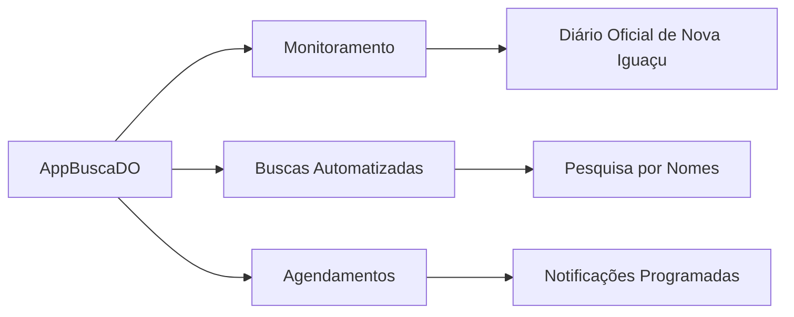

# 🚀 Projeto de Extensão AppBuscaDO

<div align="center">
  
</div>

## 📋 Visão Geral do Projeto
**Projeto de Extensão da Disciplina Programação para Dispositivos Móveis em Android**  
Desenvolvido por **Leonardo Bruno de Souza Silva**  
Matrícula: **202301011744**  
Email: [202301011744@alunos.estacio.br](mailto:202301011744@alunos.estacio.br) | [souzalb@proton.me](mailto:souzalb@proton.me)

---

### 🔄 Arquitetura e Funcionamento
O aplicativo desenvolvido em **React Native** consome uma API simples desenvolvida em **Python** com os seguintes endpoints:

| Endpoint       | Descrição                                                                 | Formato de Resposta |
|----------------|---------------------------------------------------------------------------|---------------------|
| `/dorecente`   | Retorna a versão atual em PDF do Diário Oficial                           | Link para PDF       |
| `/dobusca`     | Recebe um nome como parâmetro e retorna resultados da busca               | JSON                |
| `/status`      | Retorna o status atual do serviço                                         | JSON                |

---

## 🧩 Funcionalidades Principais


---

## ⚙️ Ambiente de Desenvolvimento

| Componente            | Versão               |
|-----------------------|----------------------|
| Sistema Operacional   | GNU/Linux Debian 12.10.0 |
| Java (JDK)            | OpenJDK 17          |
| Node.js               | v22.14.0            |
| Gecko Driver          | Linux amd64         |
| Git (opcional)        | 2.39.2+             |
| Expo                  | SDK 52              |
| Python (Backend)      | 3.11.2+             |

---

## 📁 Estrutura de Arquivos

```bash
├── app/
│   ├── index.tsx          # Ponto de entrada do App
│   └── screens/           # Telas do aplicativo
├── api/
│   ├── server-buscado.py  # Backend da aplicação
│   └── requisitos-python.txt # Dependências Python
├── app.json               # Configurações do projeto
└── package.json           # Dependências React Native
```

---

## 🚀 Como Rodar o Projeto?

### Backend (API Python)
```bash
# 1. Clone o repositório
git clone https://github.com/souza-lb/extensao-app-buscado.git

# 2. Acesse a pasta da API
cd extensao-app-buscado/api

# 3. Crie um ambiente virtual
python3 -m venv server

# 4. Ative o ambiente (Linux)
source server/bin/activate

# 5. Instale dependências
pip install -r requisitos-python.txt

# 6. Inicie o servidor
python3 server-buscado.py
```

### Frontend (Aplicativo React Native)
```bash
# 7. Abra um  novo terminal dentro da pasta "api"
cd ..

# 8. Instale dependências Node.js
npm install

# 9. Configure o ip dos endpoints
chmod +x configura-endpoint
./configura-endpoint &&

# 10. Inicia o servidor de desenvolvimento
npx expo start
```

### Após iniciar:
1. Escaneie o QR code com app Expo Go (dispositivo físico)
2. Ou pressione:  
   `a` - Android Emulator  
   `i` - iOS Simulator  
   `w` - Navegador Web

---

## 🖥️ Telas do Projeto

### 📱 Interface do Usuário

<div style="display: flex; flex-wrap: wrap; gap: 25px; justify-content: center; margin-top: 30px;">

<div style="text-align: center; flex: 1 1 300px;">
  <h3>Tela DO Atual</h3>
  
</div>

<div style="text-align: center; flex: 1 1 300px;">
  <h3>Download de Arquivo</h3>
  
</div>

<div style="text-align: center; flex: 1 1 300px;">
  <h3>Busca por Nome</h3>
  
</div>

<div style="text-align: center; flex: 1 1 300px;">
  <h3>Agendamento</h3>
  
</div>

<div style="text-align: center; flex: 1 1 300px;">
  <h3>Notificações</h3>
  
</div>

<div style="text-align: center; flex: 1 1 300px;">
  <h3>Status do Serviço</h3>
  
</div>

</div>

### ⚙️ Backend e Ferramentas

<div style="display: flex; flex-wrap: wrap; gap: 25px; justify-content: center; margin-top: 40px;">

<div style="text-align: center; flex: 1 1 500px;">
  <h3>Servidor Backend (API)</h3>
  
</div>

<div style="text-align: center; flex: 1 1 500px;">
  <h3>Ambiente Expo</h3>
  
</div>

</div>

---

## 🔄 Fluxo de Funcionamento
1. **Agendamento**: Usuário configura buscas periódicas
2. **Automação**: Sistema varre o Diário Oficial
3. **Processamento**: API Python analisa documentos
4. **Notificação**: Usuário recebe resultados via app
5. **Acesso**: Download direto dos arquivos PDF

---

## 📬 Contato
<div style="background: linear-gradient(135deg, #f0f8ff 0%, #e6f7ff 100%); padding: 20px; border-radius: 15px; margin-top: 30px; border-left: 5px solid #1890ff;">
  <p style="font-size: 18px; margin-bottom: 15px;">Desenvolvido por <strong>Leonardo Bruno de Souza Silva</strong></p>
  <p style="margin-bottom: 10px;">
    <span style="display: inline-block; background: #1890ff; color: white; padding: 8px 15px; border-radius: 30px; margin-right: 10px;">
      <a href="mailto:souzalb@proton.me" style="color: white; text-decoration: none;">souzalb@proton.me</a>
    </span>
    <span style="display: inline-block; background: #52c41a; color: white; padding: 8px 15px; border-radius: 30px;">
      <a href="mailto:202301011744@alunos.estacio.br" style="color: white; text-decoration: none;">202301011744@alunos.estacio.br</a>
    </span>
  </p>
  <p style="font-size: 16px; color: #595959;">Projeto de Extensão - Programação para Dispositivos Móveis em Android</p>
</div>

---

<div align="center" style="margin-top: 40px; padding: 20px; background: #f9f9f9; border-radius: 15px;">
  <h3>Tecnologias Utilizadas</h3>
  <div style="display: flex; justify-content: center; gap: 20px; flex-wrap: wrap; margin-top: 15px;">
    
    
    
    
    
    
  </div>
</div>

<div align="center" style="margin-top: 30px; color: #7f7f7f; font-size: 14px;">
  <p>© 2025 AppBuscaDO - Leonardo Bruno - Todos os direitos reservados</p>
</div>
